# Multi-Tenant SaaS Point-of-Sale (POS) System

[](https://nodejs.org/)
[](https://nextjs.org/)
[](https://www.postgresql.org/)
[](https://www.typescriptlang.org/)
[](LICENSE)

A production-style **multi-tenant POS platform** built to showcase full-stack architecture: **Next.js Multi-Zones microfrontends**, a **Node.js API gateway**, and **PostgreSQL row-level security** for tenant isolation — all in a **pnpm + Turborepo** monorepo with **independent CI/CD** per deployable unit.

---

## Table of Contents

- [At a Glance](#at-a-glance)
- [System Architecture](#system-architecture)
- [Multi-Zones Frontend](#multi-zones-frontend)
- [Tenant Isolation (RLS)](#tenant-isolation-rls)
- [Database Schema](#database-schema)
- [Request Flows](#request-flows)
- [API Reference](#api-reference)
- [Monorepo Layout](#monorepo-layout)
- [CI/CD Pipeline](#cicd-pipeline)
- [Quick Start](#quick-start)
- [Demo Credentials](#demo-credentials)
- [Deployment](#deployment)
- [Documentation](#documentation)
- [Roadmap](#roadmap)
- [License](#license)

---

## At a Glance

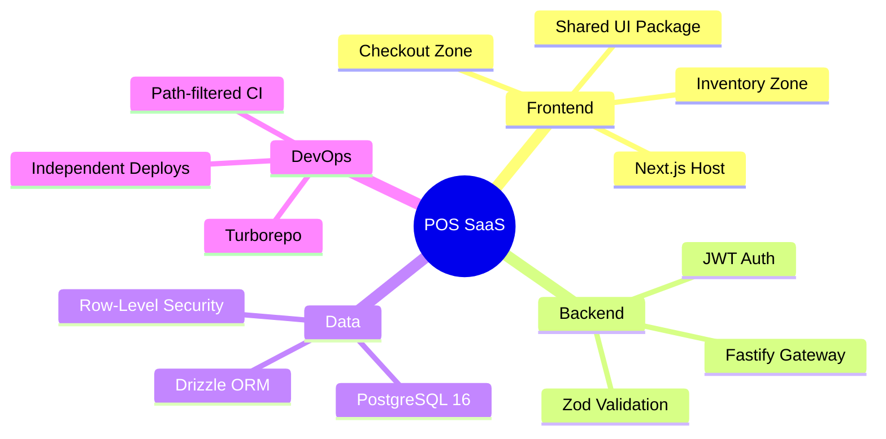

| Concern | Implementation | Why it matters |
|--------|----------------|----------------|
| **Microfrontends** | Next.js Multi-Zones (`/inventory`, `/checkout`) | Each zone builds & deploys independently |
| **Multi-tenancy** | `tenant_id` + PostgreSQL RLS | Isolation enforced at the database, not just the app |
| **API** | Fastify + JWT + transaction-scoped `set_config` | Single gateway; tenant context on every query |
| **Monorepo** | pnpm workspaces + Turborepo | Shared types, UI, and DB package across apps |

---

## System Architecture

One domain in the browser. Three independently deployable Next.js apps. One API gateway. One PostgreSQL cluster with RLS.

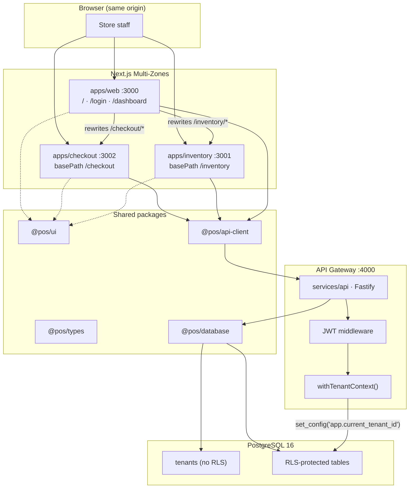

**Data flow summary**

```
Browser → Host (rewrites) → Zone apps → @pos/api-client → Gateway → Drizzle + RLS → PostgreSQL
```

---

## Multi-Zones Frontend

Each microfrontend is a **separate Next.js deployment** with its own `package.json`, port, and GitHub Actions workflow. The host stitches them together on one domain via `rewrites`.

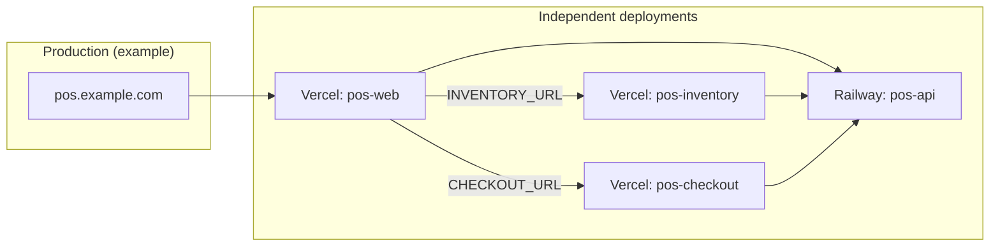

### Route map

| Path | Served by | `basePath` | Local port |
|------|-----------|------------|------------|
| `/` | Host | — | 3000 |
| `/login`, `/dashboard` | Host | — | 3000 |
| `/inventory`, `/inventory/*` | Inventory zone | `/inventory` | 3001 (proxied via host) |
| `/checkout`, `/checkout/*` | Checkout zone | `/checkout` | 3002 (proxied via host) |

### Host rewrite config

```typescript
// apps/web/next.config.ts
async rewrites() {
  return [
    { source: '/inventory', destination: `${INVENTORY_URL}/inventory` },
    { source: '/inventory/:path*', destination: `${INVENTORY_URL}/inventory/:path*` },
    { source: '/checkout', destination: `${CHECKOUT_URL}/checkout` },
    { source: '/checkout/:path*', destination: `${CHECKOUT_URL}/checkout/:path*` },
  ];
}
```

> **Note:** Cross-zone navigation uses plain `<a href="...">` tags (not `next/link` across zones), per [Next.js Multi-Zones](https://nextjs.org/docs/app/guides/multi-zones) guidance.

### Zone responsibilities

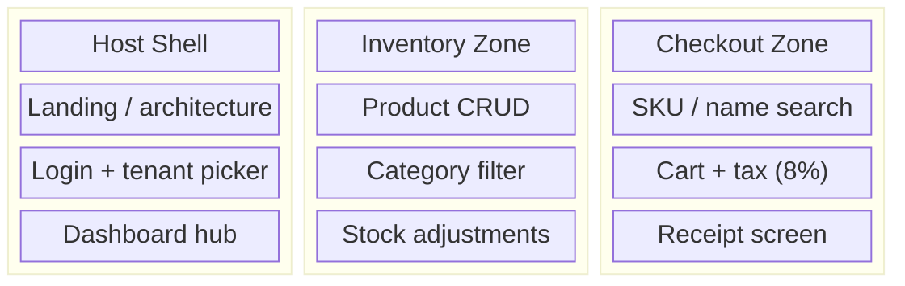

---

## Tenant Isolation (RLS)

Tenants share one PostgreSQL schema. Every business row carries a `tenant_id`. **Row-Level Security** policies compare that column to a session variable set by the API inside each transaction.

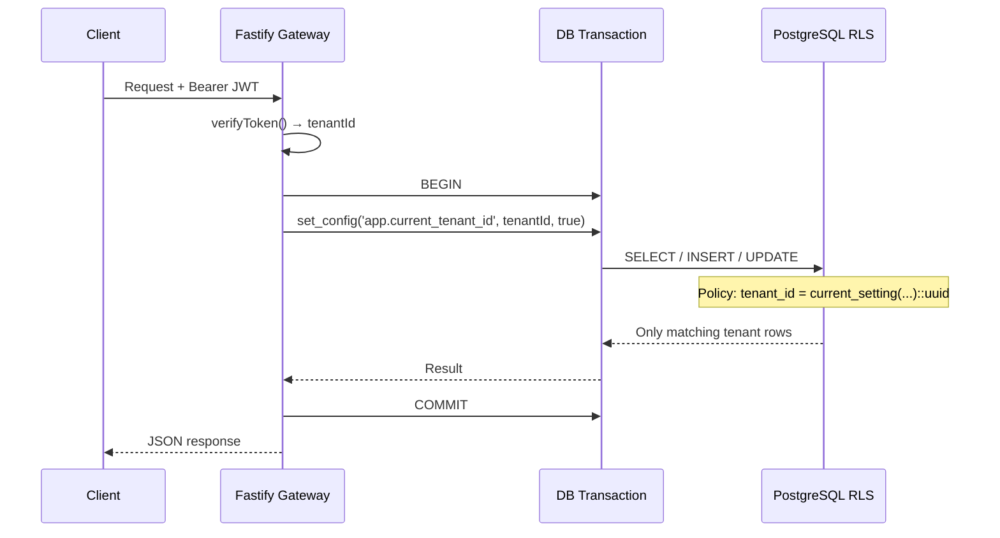

### Policy pattern (every tenant-scoped table)

```sql
ALTER TABLE products ENABLE ROW LEVEL SECURITY;
ALTER TABLE products FORCE ROW LEVEL SECURITY;

CREATE POLICY tenant_select ON products FOR SELECT
  USING (tenant_id = current_setting('app.current_tenant_id', true)::uuid);

CREATE POLICY tenant_insert ON products FOR INSERT
  WITH CHECK (tenant_id = current_setting('app.current_tenant_id', true)::uuid);
-- + UPDATE and DELETE policies
```

### Application helper

```typescript
// packages/database/src/tenant-context.ts
await tx.execute(
  sql`SELECT set_config('app.current_tenant_id', ${tenantId}, true)`,
);
```

| Layer | Isolation mechanism |
|-------|---------------------|
| JWT | `tenantId` claim — never trust client-supplied tenant in body |
| API | All tenant queries run inside `withTenantContext()` |
| PostgreSQL | RLS blocks cross-tenant reads/writes even if app code bugs |

See [docs/database.md](docs/database.md) for the full ERD and RLS table list.

---

## Database Schema

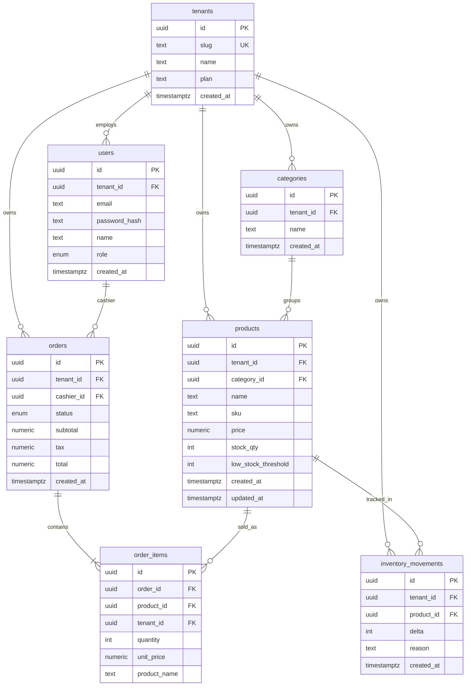

**RLS coverage:** `users`, `categories`, `products`, `orders`, `order_items`, `inventory_movements` — **`tenants` is public** (resolved before tenant context is set).

---

## Request Flows

### Authentication

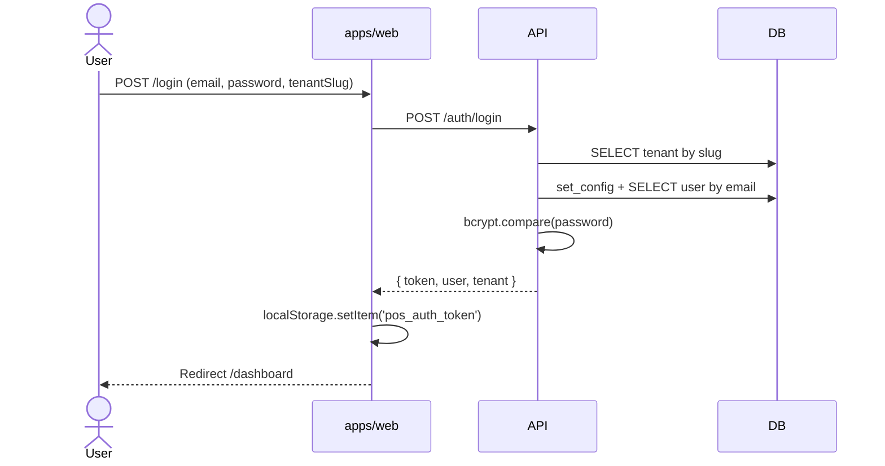

### Checkout (atomic order)

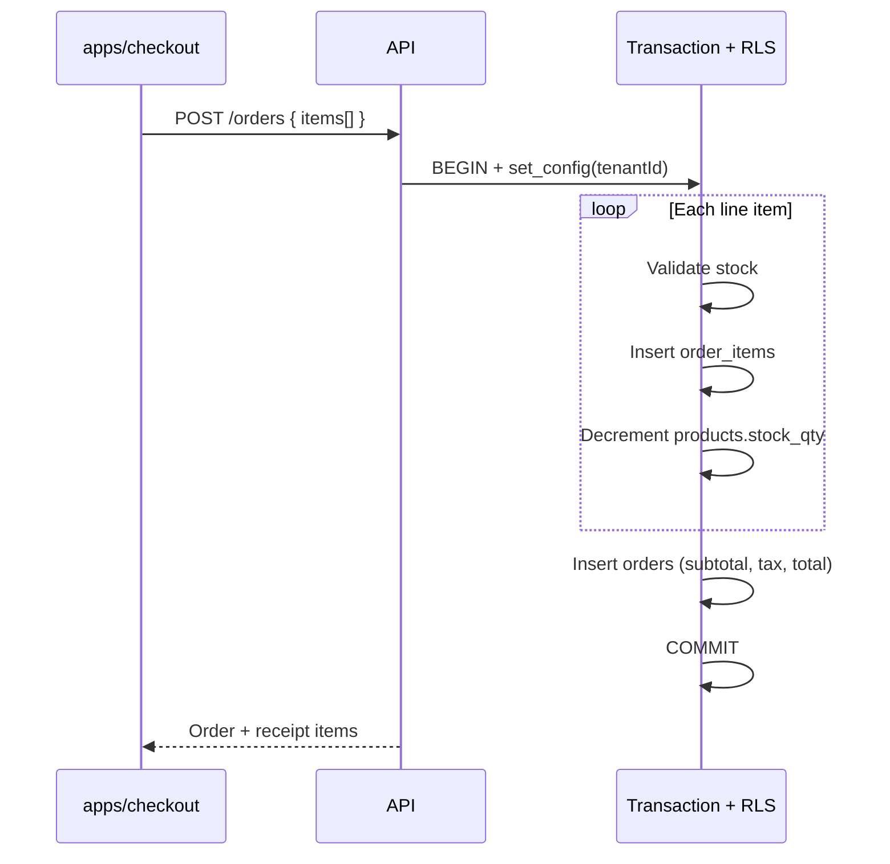

---

## API Reference

Base URL: `http://localhost:4000` (local) · Auth header: `Authorization: Bearer <token>`

| Method | Path | Auth | Description |
|--------|------|------|-------------|
| `GET` | `/health` | — | Health check |
| `GET` | `/tenants` | — | Tenant list (login picker) |
| `POST` | `/auth/login` | — | Sign in |
| `GET` | `/auth/me` | JWT | Current user + tenant |
| `GET` | `/products` | JWT | List / filter products |
| `GET` | `/products/search?q=` | JWT | Checkout search |
| `GET` | `/products/:id` | JWT | Single product |
| `POST` | `/products` | JWT | Create product |
| `PATCH` | `/products/:id` | JWT | Update product |
| `DELETE` | `/products/:id` | JWT | Delete product |
| `GET` | `/categories` | JWT | List categories |
| `POST` | `/categories` | JWT | Create category |
| `POST` | `/inventory/adjust` | JWT | Stock adjustment |
| `POST` | `/orders` | JWT | Complete sale |
| `GET` | `/orders/:id` | JWT | Receipt |

### Core schemas

<details>
<summary><strong>POST /auth/login</strong></summary>

**Request**

```json
{
  "email": "owner@acme.demo",
  "password": "demo1234",
  "tenantSlug": "acme-retail"
}
```

**Response `200`**

```json
{
  "token": "eyJhbGciOiJIUzI1NiIs...",
  "user": {
    "id": "uuid",
    "tenantId": "uuid",
    "email": "owner@acme.demo",
    "name": "Alex Owner",
    "role": "owner",
    "createdAt": "2026-06-06T..."
  },
  "tenant": {
    "id": "uuid",
    "slug": "acme-retail",
    "name": "Acme Retail",
    "plan": "pro",
    "createdAt": "2026-06-06T..."
  }
}
```

</details>

<details>
<summary><strong>GET /products</strong></summary>

**Query:** `?q=mouse&categoryId=uuid`

**Response `200`**

```json
{
  "data": [
    {
      "id": "uuid",
      "tenantId": "uuid",
      "categoryId": "uuid",
      "name": "Wireless Mouse",
      "sku": "ACM-001",
      "price": "29.99",
      "stockQty": 45,
      "lowStockThreshold": 5,
      "createdAt": "...",
      "updatedAt": "...",
      "category": { "id": "uuid", "name": "Electronics", "..." : "..." }
    }
  ]
}
```

</details>

<details>
<summary><strong>POST /orders</strong></summary>

**Request**

```json
{
  "items": [
    { "productId": "uuid", "quantity": 2 },
    { "productId": "uuid", "quantity": 1 }
  ]
}
```

**Response `201`** — tax rate fixed at **8%** in v1

```json
{
  "id": "uuid",
  "tenantId": "uuid",
  "cashierId": "uuid",
  "status": "completed",
  "subtotal": "59.98",
  "tax": "4.80",
  "total": "64.78",
  "createdAt": "...",
  "items": [
    {
      "id": "uuid",
      "productName": "Wireless Mouse",
      "quantity": 2,
      "unitPrice": "29.99"
    }
  ]
}
```

</details>

<details>
<summary><strong>Error shape</strong></summary>

```json
{
  "error": "Invalid credentials",
  "details": {}
}
```

</details>

Full endpoint documentation: [docs/api.md](docs/api.md)

---

## Monorepo Layout

```
Multi-Tenant SaaS Point-of-Sale (POS) System/
├── apps/
│   ├── web/                 # Host: landing, auth, dashboard, zone rewrites
│   ├── inventory/           # Zone: product & stock management
│   └── checkout/            # Zone: POS checkout terminal
├── services/
│   └── api/                 # Fastify gateway
├── packages/
│   ├── database/            # Drizzle schema, migrations, RLS, seed
│   ├── ui/                  # Shared React components (Tailwind)
│   ├── types/               # Shared TypeScript DTOs
│   ├── api-client/          # JWT-aware fetch wrapper
│   └── tsconfig/            # Shared TS configs
├── docs/                    # Extended documentation
├── .github/workflows/       # CI + path-filtered deploy pipelines
├── docker-compose.yml       # PostgreSQL 16
├── turbo.json
└── pnpm-workspace.yaml
```

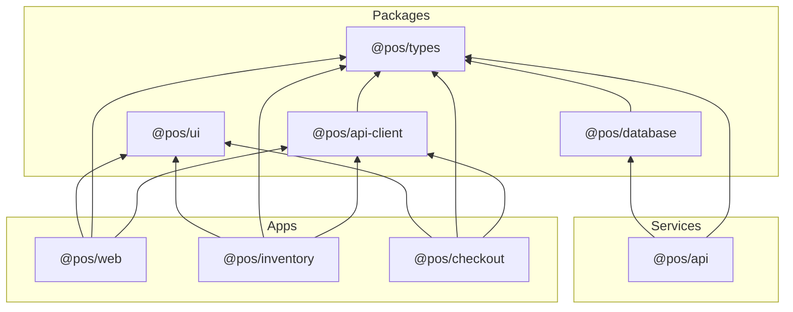

---

## CI/CD Pipeline

Each deployable unit has a **path-filtered** workflow — changes to shared `packages/**` can trigger all dependent builds.

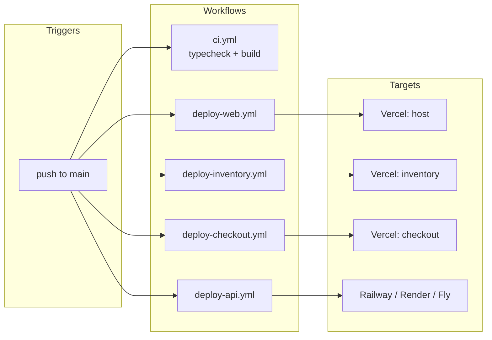

| Workflow | Paths watched | Build target |
|----------|---------------|--------------|
| `ci.yml` | All | `pnpm typecheck` + `pnpm build` |
| `deploy-web.yml` | `apps/web/**`, `packages/**` | `@pos/web` |
| `deploy-inventory.yml` | `apps/inventory/**`, `packages/**` | `@pos/inventory` |
| `deploy-checkout.yml` | `apps/checkout/**`, `packages/**` | `@pos/checkout` |
| `deploy-api.yml` | `services/api/**`, `packages/database/**` | `@pos/api` |

---

## Quick Start

### Prerequisites

| Tool | Version |
|------|---------|
| Node.js | 20+ |
| pnpm | 9+ |
| Docker | for PostgreSQL |

### Setup

```bash
# 1. Clone and install
git clone <your-repo-url>
cd "Multi-Tenant SaaS Point-of-Sale (POS) System"
pnpm install

# 2. Environment
cp .env.example .env

# 3. Database
docker compose up -d
pnpm db:generate
pnpm db:migrate
pnpm db:seed

# 4. Run everything
pnpm dev
```

### Local URLs

| What | URL |
|------|-----|
| **Host (use this)** | http://localhost:3000 |
| Dashboard | http://localhost:3000/dashboard |
| Inventory (via host) | http://localhost:3000/inventory |
| Checkout (via host) | http://localhost:3000/checkout |
| Inventory (direct zone) | http://localhost:3001/inventory |
| Checkout (direct zone) | http://localhost:3002/checkout |
| API | http://localhost:4000 |
| API health | http://localhost:4000/health |

### Verify API

```bash
curl -s http://localhost:4000/health
curl -s -X POST http://localhost:4000/auth/login \
  -H "Content-Type: application/json" \
  -d '{"email":"owner@acme.demo","password":"demo1234","tenantSlug":"acme-retail"}'
```

---

## Demo Credentials

| Tenant | Slug | Email | Password | Role |
|--------|------|-------|----------|------|
| Acme Retail | `acme-retail` | `owner@acme.demo` | `demo1234` | owner |
| Acme Retail | `acme-retail` | `cashier@acme.demo` | `demo1234` | cashier |
| Corner Cafe | `corner-cafe` | `owner@cafe.demo` | `demo1234` | owner |

**Seed data:** Acme — 20 products, 3 categories, 1 sample order · Cafe — 10 products, 2 categories

---

## Deployment

### Environment variables

| Variable | Where | Purpose |
|----------|-------|---------|
| `DATABASE_URL` | API | PostgreSQL connection |
| `JWT_SECRET` | API | Token signing |
| `CORS_ORIGIN` | API | Allowed frontend origin |
| `INVENTORY_URL` | Host | Zone rewrite target |
| `CHECKOUT_URL` | Host | Zone rewrite target |
| `NEXT_PUBLIC_API_URL` | All frontends | API base URL |

### Production topology

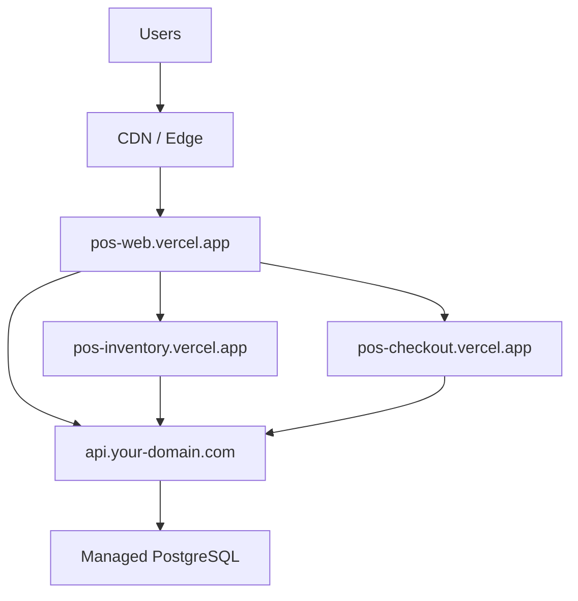

1. Deploy **inventory** and **checkout** zones to separate Vercel projects.
2. Deploy **API** to Railway, Render, or Fly.io with managed Postgres.
3. Deploy **host** with `INVENTORY_URL`, `CHECKOUT_URL`, and `NEXT_PUBLIC_API_URL` set.
4. Run migrations against production: `pnpm db:migrate && pnpm db:seed` (seed optional).

---

## Documentation

| Document | Contents |
|----------|----------|
| [docs/architecture.md](docs/architecture.md) | Deep-dive: Multi-Zones, package boundaries, auth token sharing |
| [docs/api.md](docs/api.md) | Full REST reference with request/response schemas |
| [docs/database.md](docs/database.md) | ERD, RLS policies, migrations, seed script |

---

## Roadmap

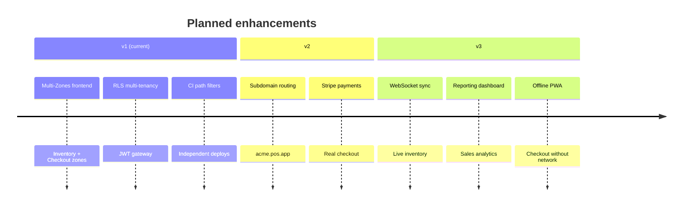

---

## License

[MIT](LICENSE)
