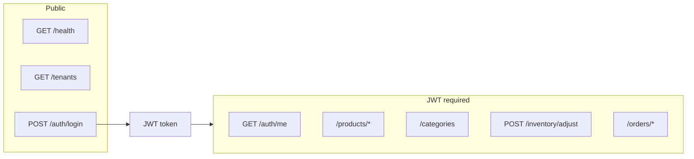

# API Reference

**Base URL:** `http://localhost:4000` (development)

**Authentication:** Protected routes require `Authorization: Bearer <jwt>`.

---

## Overview



---

## Health

### `GET /health`

No authentication.

**Response `200`**

```json
{ "status": "ok" }
```

---

## Tenants

### `GET /tenants`

Lists all tenants for the login picker. No RLS (public registry table).

**Response `200`**

```json
{
  "data": [
    {
      "id": "062afc90-618c-4fc9-b7ea-af7e67cd7208",
      "slug": "acme-retail",
      "name": "Acme Retail",
      "plan": "pro",
      "createdAt": "2026-06-06T10:00:00.000Z"
    }
  ]
}
```

---

## Authentication

### `POST /auth/login`

**Request body**

| Field | Type | Required | Description |
|-------|------|----------|-------------|
| `email` | string | yes | User email |
| `password` | string | yes | Plain text password |
| `tenantSlug` | string | yes | Tenant slug (e.g. `acme-retail`) |

```json
{
  "email": "owner@acme.demo",
  "password": "demo1234",
  "tenantSlug": "acme-retail"
}
```

**Response `200` — `AuthResponse`**

```typescript
interface AuthResponse {
  token: string;      // JWT, expires in 24h
  user: User;
  tenant: Tenant;
}
```

**JWT payload claims**

| Claim | Type | Description |
|-------|------|-------------|
| `userId` | uuid | User ID |
| `tenantId` | uuid | Tenant ID (used for RLS) |
| `role` | `owner` \| `manager` \| `cashier` | User role |
| `email` | string | User email |

**Errors**

| Status | Reason |
|--------|--------|
| `400` | Invalid body (Zod) |
| `401` | Wrong email, password, or tenant |

---

### `GET /auth/me`

**Headers:** `Authorization: Bearer <token>`

**Response `200`**

```json
{
  "user": { "id": "...", "tenantId": "...", "email": "...", "name": "...", "role": "owner", "createdAt": "..." },
  "tenant": { "id": "...", "slug": "...", "name": "...", "plan": "...", "createdAt": "..." }
}
```

---

## Products

### `GET /products`

**Query parameters**

| Param | Type | Description |
|-------|------|-------------|
| `q` | string | Search name or SKU (case-insensitive) |
| `categoryId` | uuid | Filter by category |

**Response `200`**

```json
{
  "data": [ /* Product[] */ ]
}
```

**Product schema**

```typescript
interface Product {
  id: string;
  tenantId: string;
  categoryId: string | null;
  name: string;
  sku: string;
  price: string;           // decimal string, e.g. "29.99"
  stockQty: number;
  lowStockThreshold: number;
  createdAt: string;       // ISO 8601
  updatedAt: string;
  category?: Category | null;
}
```

---

### `GET /products/search?q={query}`

Optimized for checkout terminal. Returns up to 20 matches.

Same `Product` shape as list endpoint.

---

### `GET /products/:id`

**Response `200`:** single `Product`  
**Response `404`:** not found (or RLS hides row)

---

### `POST /products`

**Request body**

```json
{
  "name": "New Product",
  "sku": "ACM-999",
  "price": "19.99",
  "stockQty": 10,
  "lowStockThreshold": 5,
  "categoryId": "uuid-or-null"
}
```

**Response `201`:** created `Product`

---

### `PATCH /products/:id`

Partial update — all fields optional (same shape as create).

**Response `200`:** updated `Product`

---

### `DELETE /products/:id`

**Response `200`**

```json
{ "success": true }
```

---

## Categories

### `GET /categories`

**Response `200`**

```json
{
  "data": [
    {
      "id": "uuid",
      "tenantId": "uuid",
      "name": "Electronics",
      "createdAt": "..."
    }
  ]
}
```

---

### `POST /categories`

**Request body**

```json
{ "name": "Seasonal" }
```

**Response `201`:** created `Category`

---

## Inventory

### `POST /inventory/adjust`

Adjust stock and write an audit row to `inventory_movements`.

**Request body**

```json
{
  "productId": "uuid",
  "delta": 10,
  "reason": "Restock from supplier"
}
```

| Field | Type | Notes |
|-------|------|-------|
| `delta` | integer | Positive or negative; result cannot go below 0 |

**Response `200`:** updated `Product`

**Errors**

| Status | Reason |
|--------|--------|
| `400` | Insufficient stock after adjustment |
| `404` | Product not found |

---

## Orders

### `POST /orders`

Creates a completed order atomically: validates stock, inserts order + items, decrements inventory.

**Request body**

```json
{
  "items": [
    { "productId": "uuid", "quantity": 2 },
    { "productId": "uuid", "quantity": 1 }
  ]
}
```

**Tax:** 8% applied server-side in v1.

**Response `201`**

```typescript
interface Order {
  id: string;
  tenantId: string;
  cashierId: string;       // from JWT userId
  status: "completed";
  subtotal: string;
  tax: string;
  total: string;
  createdAt: string;
  items: OrderItem[];
}
```

**Errors**

| Status | Reason |
|--------|--------|
| `400` | Empty cart, product not found, insufficient stock |

---

### `GET /orders/:id`

Returns order with line items (receipt view).

**Response `200`:** `Order` with `items[]`

---

## Error envelope

All errors follow this shape:

```typescript
interface ApiError {
  error: string;
  details?: unknown;   // Zod flatten object on validation errors
}
```

**Example `400`**

```json
{
  "error": "Invalid request",
  "details": {
    "fieldErrors": { "email": ["Invalid email"] },
    "formErrors": []
  }
}
```

---

## Type definitions

Shared TypeScript types live in [`packages/types/src/index.ts`](../packages/types/src/index.ts) and are consumed by both frontend and backend.
