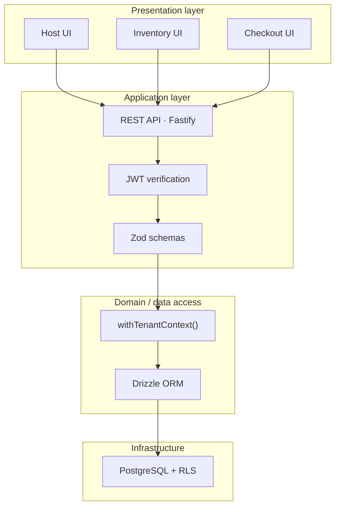
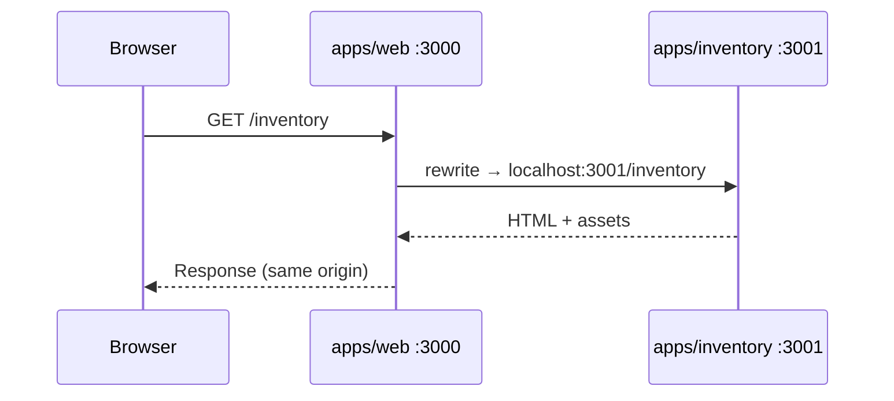
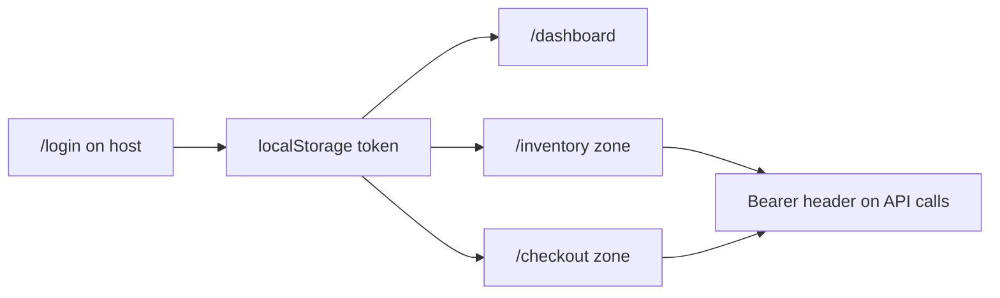
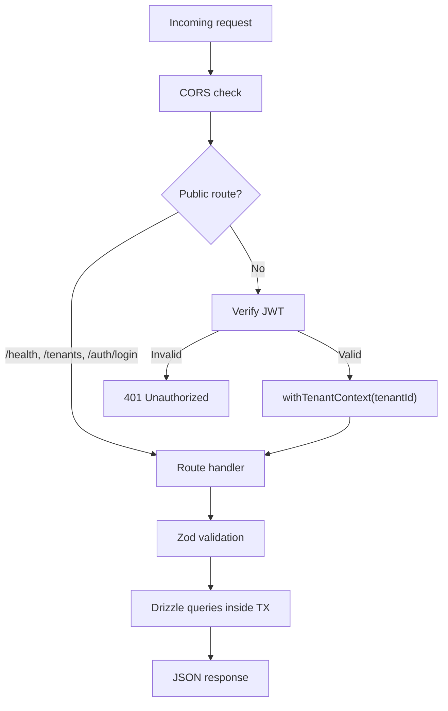
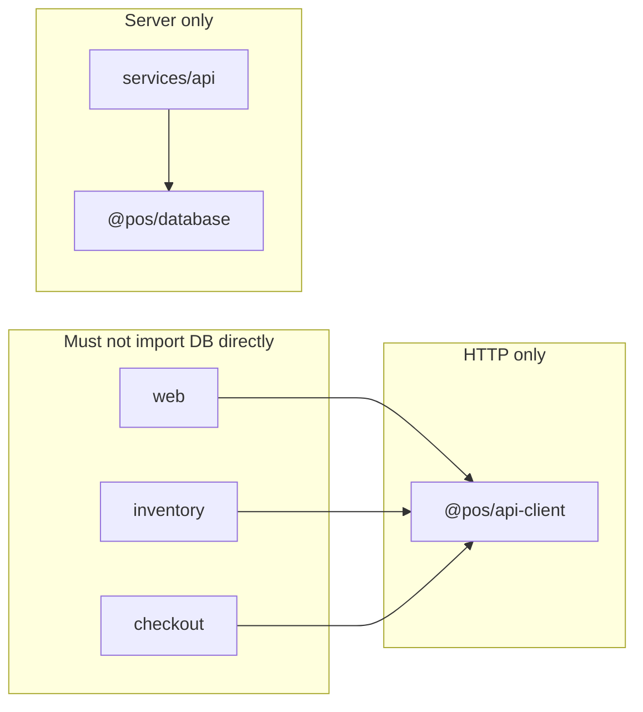

# Architecture

This document expands on the system design decisions behind the Multi-Tenant POS SaaS platform.

## Design goals

| Goal | How it is achieved |
|------|-------------------|
| Showcase frontend architecture | Next.js Multi-Zones with independent deploys |
| Showcase backend architecture | Fastify gateway + PostgreSQL RLS |
| Showcase DevOps | Path-filtered GitHub Actions per service |
| Safe multi-tenancy | Database-enforced isolation, not app-only filtering |

---

## Layered architecture

---

## Multi-Zones in detail

### Why Multi-Zones (not Module Federation)?

| Approach | Pros | Cons | Used here? |
|----------|------|------|------------|
| **Multi-Zones** | Simple rewrites, full Next.js per zone, easy Vercel deploy | Hard navigation between zones | Yes |
| Module Federation | Runtime remotes, shared deps | Complex webpack config | No |
| npm packages | Easiest monorepo | Weak independent deploy story | Partial (`@pos/ui`) |

### Request routing (local dev)

### Zone configuration

| App | `basePath` | Dev port | Rewritten by host |
|-----|------------|----------|-------------------|
| `apps/web` | — | 3000 | — |
| `apps/inventory` | `/inventory` | 3001 | Yes |
| `apps/checkout` | `/checkout` | 3002 | Yes |

---

## Authentication & cross-zone sessions

JWT is stored in **`localStorage`** under the key `pos_auth_token` via `@pos/api-client`.

Because all zones are served from the **same origin** when using the host rewrites (`localhost:3000`), `localStorage` is shared automatically.

> For production with separate Vercel project URLs behind rewrites, the browser still sees one origin (the host domain), so the same pattern works.

---

## API gateway responsibilities

The gateway **never** accepts `tenant_id` from the client for authorization. The tenant always comes from the JWT payload after login.

---

## Package boundaries

| Package | Runs on | Imports database? |
|---------|---------|-------------------|
| `apps/*` | Browser + SSR | No |
| `@pos/api-client` | Browser | No |
| `services/api` | Node.js | Yes |
| `@pos/database` | Node.js | — |

---

## Error handling strategy

| Layer | Behavior |
|-------|----------|
| Zod | `400` with `{ error, details }` |
| Auth | `401` for missing/invalid JWT |
| RLS / not found | `404` when row invisible or missing |
| Business rules | `400` (e.g. insufficient stock) |

---

## Related docs

- [API reference](./api.md)
- [Database & RLS](./database.md)
- [README](../README.md)
