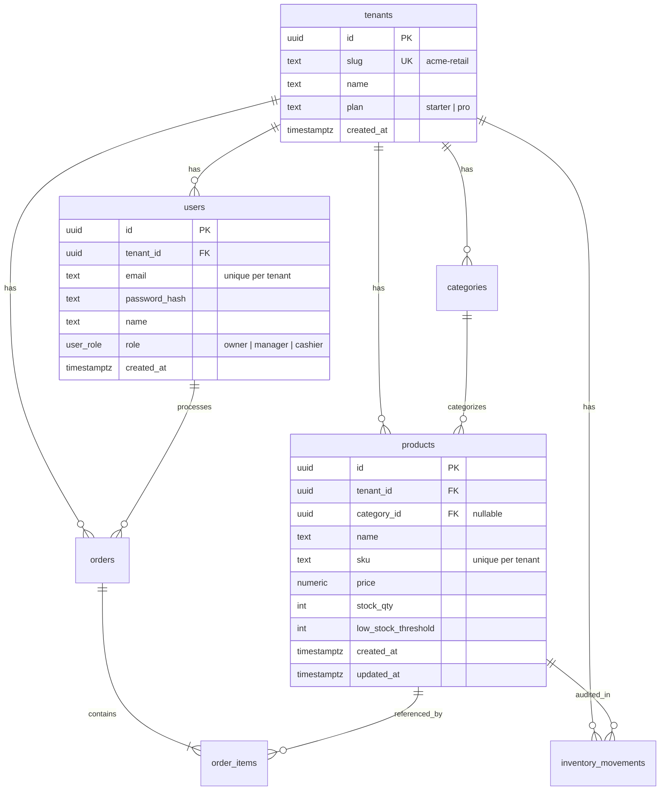
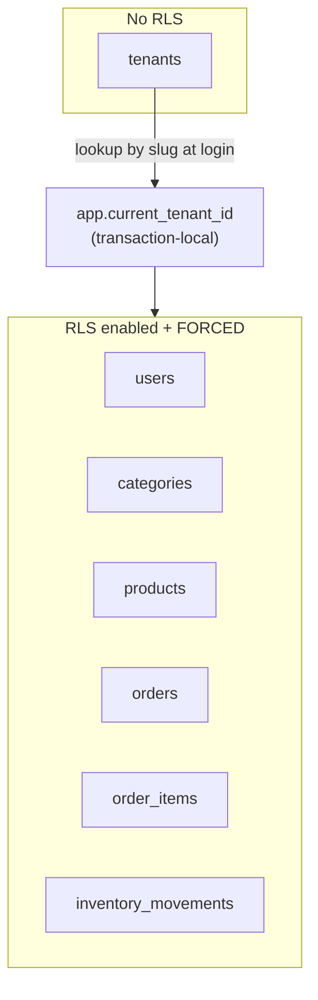
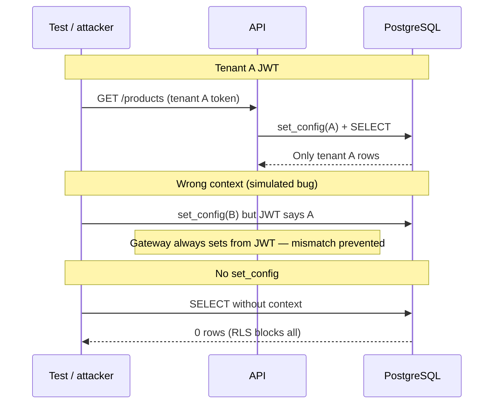
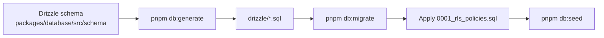
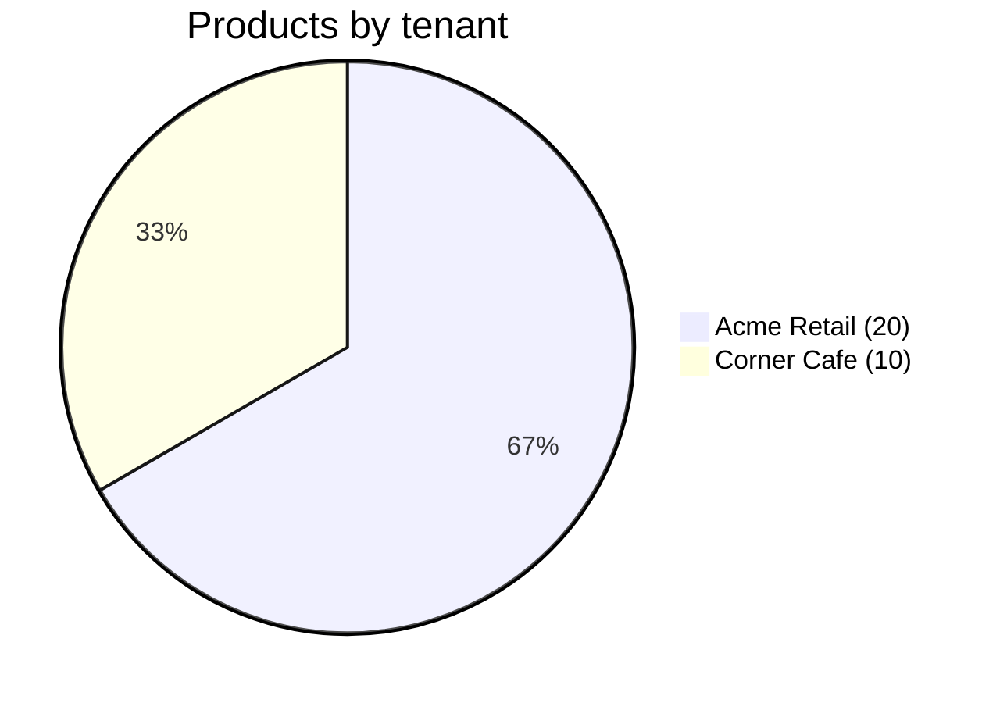

# Database

PostgreSQL 16 with **Drizzle ORM** for schema/migrations and **Row-Level Security (RLS)** for tenant isolation.

---

## Entity relationship diagram



---

## RLS model



### Session variable

Set at the start of every authenticated transaction:

```sql
SELECT set_config('app.current_tenant_id', '<tenant-uuid>', true);
```

The third argument `true` makes the setting **transaction-local** — it cannot leak to other connections or requests.

### Policy template

Applied to each RLS table (`users`, `categories`, `products`, `orders`, `order_items`, `inventory_movements`):

```sql
-- SELECT
CREATE POLICY tenant_select ON <table> FOR SELECT
  USING (tenant_id = current_setting('app.current_tenant_id', true)::uuid);

-- INSERT
CREATE POLICY tenant_insert ON <table> FOR INSERT
  WITH CHECK (tenant_id = current_setting('app.current_tenant_id', true)::uuid);

-- UPDATE
CREATE POLICY tenant_update ON <table> FOR UPDATE
  USING (tenant_id = current_setting('app.current_tenant_id', true)::uuid);

-- DELETE
CREATE POLICY tenant_delete ON <table> FOR DELETE
  USING (tenant_id = current_setting('app.current_tenant_id', true)::uuid);
```

Source: [`packages/database/migrations/0001_rls_policies.sql`](../packages/database/migrations/0001_rls_policies.sql)

---

## Isolation verification



---

## Indexes

| Index | Columns | Purpose |
|-------|---------|---------|
| `users_tenant_email_idx` | `(tenant_id, email)` | Unique email per tenant |
| `products_tenant_sku_idx` | `(tenant_id, sku)` | Unique SKU per tenant |
| `categories_tenant_name_idx` | `(tenant_id, name)` | Unique category name per tenant |

---

## Enums

```sql
CREATE TYPE user_role AS ENUM ('owner', 'manager', 'cashier');
CREATE TYPE order_status AS ENUM ('pending', 'completed', 'cancelled');
```

---

## Migrations workflow



| Command | Description |
|---------|-------------|
| `pnpm db:generate` | Generate SQL from Drizzle schema changes |
| `pnpm db:migrate` | Run Drizzle migrations + RLS policies |
| `pnpm db:seed` | Insert demo tenants, users, products (idempotent) |

---

## Seed data



| Tenant | Slug | Users | Categories | Products | Orders |
|--------|------|-------|------------|----------|--------|
| Acme Retail | `acme-retail` | owner, cashier | 3 | 20 | 1 sample |
| Corner Cafe | `corner-cafe` | owner | 2 | 10 | — |

All demo passwords: **`demo1234`** (bcrypt hashed in seed script).

---

## Docker setup

```yaml
# docker-compose.yml
postgres:
  image: postgres:16-alpine
  ports: ["5432:5432"]
  environment:
    POSTGRES_USER: pos_app
    POSTGRES_PASSWORD: pos_secret
    POSTGRES_DB: pos_saas
```

Init scripts in `packages/database/init/` grant the app role without superuser privileges so RLS applies to the API connection.

---

## Application helper

```typescript
// packages/database/src/tenant-context.ts
export async function withTenantContext<T>(
  tenantId: string,
  fn: (tx: DbTransaction) => Promise<T>,
): Promise<T> {
  return db.transaction(async (tx) => {
    await tx.execute(
      sql`SELECT set_config('app.current_tenant_id', ${tenantId}, true)`,
    );
    return fn(tx);
  });
}
```

Used by:

- `services/api` route handlers (via `runWithTenant`)
- `packages/database/src/seed.ts` (tenant-scoped inserts)

---

## Related docs

- [Architecture](./architecture.md)
- [API reference](./api.md)
- [README](../README.md)
